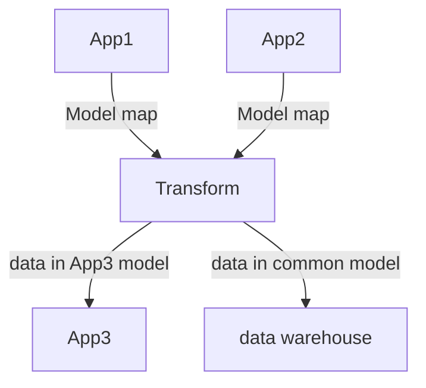

# data-model-map  
Data Model Mapping and Repository 

Problem: The process of mapping between models or schemas is time-consuming and requires manual effort. Once a subject matter expert completes the mapping, writing code to transform the data becomes straightforward.  

Solution: The process of model or schema mapping can be semi-automated using algorithms. It is recommended that an organization maintains a mapping repository, which can be utilized for various projects such as application integration, data warehousing, data fabric, and AI algorithms.  

DataJoin.net provides in-depth education and consultation on Model map repository.  

## Flowchart  

