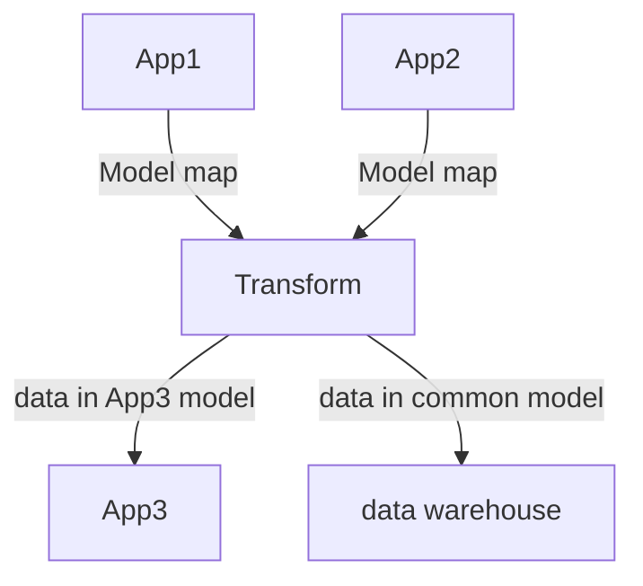

# data-model-map  
Data Model Mapping and Repository 

Problem: The process of mapping between models or schemas is time-consuming and requires manual effort. Once a subject matter expert completes the mapping, writing code to transform the data becomes straightforward.  

Solution: The process of model or schema mapping can be semi-automated using algorithms. It is recommended that an organization maintains a mapping repository, which can be utilized for various projects such as application integration, data warehousing, data fabric, and AI algorithms.  

DataJoin.net provides in-depth education and consultation on Model map repository.  

milan@datajoin.net  
http://datajoin.net  

## Flowchart  

## Data Model  
An App has Entity type data and Instance (item) data.  For example, laptop is a product type, specific serial number laptop is an instance(item). Typically, type data are small in size while instance (item) data are in large size. Whenever entities are stored in structure format there is a data model.  

Both Entity type and Instance (item) data have the following:  
•	Entities have hierarchy  
•	Entities have attributes at each level in hierarchy  
•	Entities have relationships with other entities  
•	Some entities are singular such as Customer, Organization, Equipment.  
•	Some entities are composite since they are a combination of two or more entities such as Employment history (combination of person, organization and time period), Sales Order (Sales Order is item, customer, ship to address)  

## Data models have two parts:  
Data model part 1: Schema (structure) description where entities (type and instance), hierarchy and attributes are stored.  
Data model part 2: Entity type (category) list (its hierarchy and attributes)  

Data model part 1 schema example: table product_type, table attributes product_type_id, product_type_name  
Data model part 2 entity type (category) example: product_type = p1:laptop, p2:desktop

## Model and mapping repository code  
test _etl_db1 in postgreSQL is created using admin UI. This database has the following tables.
product_type: category or type data  
sales_order: transaction or instance data  
st_mapping_set_v3:  mapping set. This is considered as mapping repository.  
st_mapping_set_detail_v3: specific value or schema column level mapping. This is considered as mapping repository.  
st_schema_table: all the table in one or more database. This is considered as model repository  
st_schema_attribute: all attributes for all tables for one or more databases. This is considered as model repository.
Use test_etl_db1_backup.sql to create these tables and populate with test data.   

Test_etl_db2 in postgreSQL is created using admin UI. This database has the following tables.  
Item_type: category or type data  
Sales_txn: transaction or instance data   
Use test_etl_db2_backup.sql to create these tables and populate with test data.   

